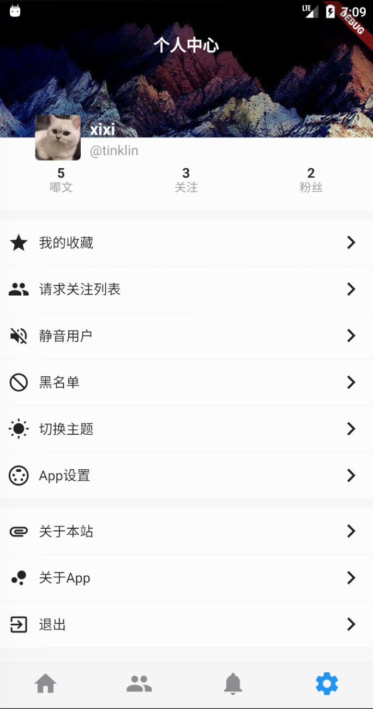

Language: [English](./README.md) | [中文简体](./README.zh.md)

# Fastodon

这是一个用Flutter实践的Mastodon客户端，用来总结之前所学习的Flutter相关知识。本项目涉及了自定义Widget、组件、页面跳转等常用功能，使用常见的第三方package，如dio、cached_network_image等。目标是开发一款兼容双平台并且可以使用的App👏

[Mastodon](https://joinmastodon.org/)是一个免费开源的去中心化的分布式微博客社交网络。Mastodon是开放源代码的、基于网络的分布式微博客软件。 后端以Ruby on Rails编写，而前端以JavaScript编写。本项目利用了其开源API实现，[开发文档在此](https://docs.joinmastodon.org/)。后续会考虑翻译该API文档。

## 下载项目
本项目由Flutter开发，首先要确保本地环境具有Flutter开发环境。如果暂未配置，可参考[中文文档](https://flutterchina.club/docs/)和[英文文档](https://flutter.dev/docs/get-started/install)

```
git clone https://github.com/mah93/Fastodon
cd ./Fastodon
flutter packages get
flutter run
```
即可成功在模拟器/真机中运行（Android与iOS均可）。

P.S.遇到任何问题可以在[issuse](https://github.com/mah93/Fastodon/issuse)中提问。

## Mastodon使用方法

Mastodon 与 Twitter 不同，Mastodon 是一个开源项目，并且允许用户创建自己的服务器，不同服务器之间的用户可以毫无隔阂地交流，这和电子邮件系统非常相似。A 服务器上注册的用户可以自由地关注 B 服务器上注册的另个用户，发 TOOT @ 他，并且及时地得到回复和通知。

### 选择一个服务器
在你想要加入Mastodon之前，你必须首先选择一个服务器进行注册登录。你可以根据自己的喜好加入不同的服务器中(每个服务器根据搭建者的意愿发展成了不同的社区文化)所有的服务器列表在[这里](https://joinmastodon.org/)。当然你也可以搭建属于自己的服务器，搭建自己的服务器请参阅[github](https://github.com/tootsuite/documentation#running-mastodon)。

### 注册&登录
选择好服务器之后，会提示跳转到登录页面。如果还没有账号，只需要提供邮箱即可完成注册！(账号信息在不同的服务器上不共享，但是可以浏览到其他服务器的内容，或者是添加好友)

OK！just fine～

## 预览效果
### iOS模拟器效果

|  |  |  |
|-|-|-|
|     |      |      |

### Android模拟器效果

|  |  |  |
|-|-|-|
|     |      |      |

## 关于测试
如果你并不想使用Mastodon客户端，而只是想测试该App，推荐使用acg.mn进行测试。该站点无需翻墙，只需输入acg.mn后点击登录，通过邮箱即可注册完成进入首页。

## 使用的开源组件

| 组件  | 版本         | 说明     |
| -------- | ------------------------- | -------- |
| dio     | ^2.0.2     | 网络请求框架     |
| json_serializable      | ^2.0.0      | json解析  |
| cached_network_image    | ^0.6.0    | 网络图片缓存     |
| shared_preferences   | ^0.5.1+1   | 本地存储     |
| flutter_spinkit  | ^3.1.0  | loading等待视图     |
| fluttertoast | ^3.0.1 | 提示信息     |
| flutter_webview_plugin    | ^0.3.0+2    | 提供WebView     |
| flutter_html   | ^0.9.4   | 解析html     |
| url_launcher   | ^5.0.2   | 打开浏览器     |

## 开源协议

[MIT](./LICENSE)
